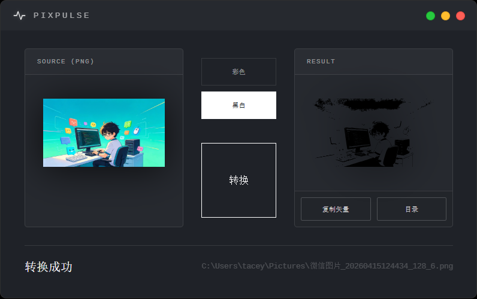

# PIXPULSE

High-performance desktop vector engine for PNG ↔ SVG conversion.



## 🧠 Overview

PixPulse is a specialized desktop tool designed for developers and designers who need high-quality vectorization and rendering. Inspired by industrial minimalism, it provides a clean, terminal-like interface for complex image processing tasks.

## ✨ Features

*   **PNG to Color SVG:** Powered by `vtracer` for high-fidelity color vectorization.
*   **PNG to B&W SVG:** Powered by `potrace` for clean, professional-grade line art.
*   **SVG to PNG:** High-performance rendering using `resvg`.
*   **Zero-Config UI:** Just drag, drop, and execute.
*   **Native Performance:** CLI-driven processing with a Go-powered backend.

## 🛠️ Tech Stack

*   **Frontend:** Vue 3 + Vite + TypeScript
*   **Backend:** Go (Wails v2)
*   **Engines:** `vtracer`, `potrace`, `resvg`
*   **Design System:** xAI-inspired brutalist minimalism

## 🚀 Getting Started

### Prerequisites

*   Go 1.23+
*   Node.js 18+
*   Wails CLI (`go install github.com/wailsapp/wails/v2/cmd/wails@latest`)

### Installation

1. Clone the repository:
   ```bash
   git clone https://github.com/TaceyWong/PixPulse.git
   cd PixPulse
   ```

2. Install dependencies:
   ```bash
   cd frontend && npm install && cd ..
   ```

3. Run in development mode:
   ```bash
   wails dev
   ```

4. Build for production:
   ```bash
   wails build
   ```

## 📦 Distribution

The build output will include the `PixPulse.exe` and a `bin/` directory containing the necessary CLI tools. Ensure they remain together for the application to function correctly.

## ⚖️ License

MIT License - see [LICENSE](LICENSE) for details.

---

Built with ❤️ by [Tacey Wong](https://github.com/TaceyWong)
